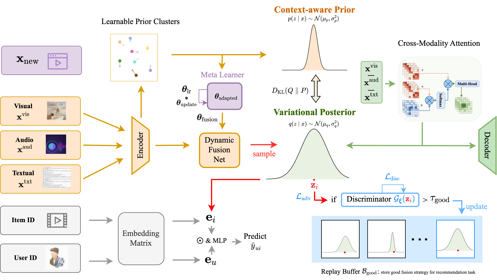

# VBF++: Variational Bayesian Fusion with Context-Aware Priors and Recommendation-Guided Adversarial Refinement for Multimodal Video Recommendation

<p align="center">
    
</p>

We present **VBF++**, a **variational Bayesian fusion framework** for multimodal video recommendation. It models the fusion strategy as a **distribution** rather than a deterministic point, introducing **context-aware priors** and **recommendation-guided adversarial refinement (RAR)** to align the generative objective with recommendation goals. Together with a **meta-learning-based fast adaptation** mechanism, VBF++ effectively handles cross-domain and sparse scenarios. Extensive experiments on MovieLens, TikTok, and Kuaishou demonstrate consistent improvements and interpretable modality behaviors.

---

## Catalogue

- [Getting Started](#getting-started)  
- [Code Structure](#code-structure)  
- [Data Processing](#data-processing)  
- [Quick Run](#quick-run)  
  - [Format & Preprocess](#format--preprocess)  
  - [Triplet Generation](#triplet-generation)  
  - [Train](#train)  
  - [Test](#test)  
- [Method Highlights](#method-highlights)  
- [Results (Summary)](#results-summary)  
- [Citation](#citation)  
- [Contact](#contact)

---

## Getting Started

1) Clone and enter the project folder
```bash
git clone https://github.com/muhhpu/VBF.git
cd VBF
```

2) Install dependencies (Python ≥3.9 recommended)
```bash
pip install -r requirements.txt
```

All training and testing scripts are designed to run **without command-line parameters** for ease of use.

---

## Code Structure

```
VBF/
├─ checkpoints/
├─ dataset/
│  ├─ KuaiRec 2.0/
│  ├─ ml-10M100K/
│  └─ tiktok/
├─ dataset_sample/
│  ├─ Kwai/
│  ├─ movielens/
│  └─ tiktok/
├─ output/
├─ pro_data/
├─ pro_feature/
├─ pro_triple/
├─ context_prior.py
├─ cpd_layer.py
├─ data_load.py
├─ data_triple.py
├─ dual_decoder.py
├─ format_Kwai.py
├─ format_ml.py
├─ format_tiktok.py
├─ Fusion_model.py
├─ GCN_model.py
├─ meta_layer.py
├─ meta_learner.py
├─ model_train.py
├─ model_test.py
└─ README.md
```

---
## Datasets & Features

We use three real-world multimodal video recommendation datasets:

- **[MovieLens-10M](https://grouplens.org/datasets/movielens/10m/)** – Classic benchmark of 10M user–movie ratings and tags from GroupLens.
- **[TikTok](http://ai-lab-challenge.bytedance.com/tce/vc/)** – Public subset of TikTok videos with multimodal (visual, audio, text) features and user–item interactions.
- **[Kwai](https://www.kwai.com/)** – Realistic short-video recommendation dataset released by Kuaishou Research Institute, including multimodal video features and user interactions.

## Data Processing

**Datasets & Features**

- **MovieLens-10M**: Visual features from ResNet50 (10 keyframes per trailer averaged to 2048-d), audio from VGGish (128-d), text from Sentence2Vec (100-d).  
- **TikTok**: 128-d multimodal embeddings (visual: I3D, audio: VGGish, text: DistilBERT).  
- **Kuaishou**: Visual features from ResNet152 (1 fps → 2048-d), text embeddings from Chinese BERT (128-d).

**Dataset Scale**  
MovieLens(55.5K/6.0K/1.24M), TikTok(36.7K/76.1K/726K), Kuaishou(10.0K/292K/8.66M).

**Hyperparameters (Appendix A/B/C)**  
Structured prior clusters K=8, β∈[0.005,0.02], learning rate=1e-3, etc.

---

## Quick Run

### Format & Preprocess
```bash
# MovieLens
python format_ml.py

# Kuaishou (Kwai)
python format_Kwai.py

# TikTok
python format_tiktok.py

# Merge and cache
python data_load.py
```

### Triplet Generation
```bash
python data_triple.py
```

### Train
```bash
python model_train.py
```

### Test
```bash
python model_test.py
```

> Scripts automatically read preprocessed data from `pro_data/`, `pro_feature/`, and `pro_triple/`.

---

## Method Highlights

- **Variational Fusion:** Models fusion strategy as latent variable z to capture uncertainty and robustness to missing modalities.  
- **Context-Aware Prior:** Learns structured Gaussian mixture priors (K=8) to encode semantic-dependent fusion patterns.  
- **RAR (Recommendation-Guided Adversarial Refinement):** Aligns variational learning with ranking objectives through discriminator-guided signal.  
- **Meta-Learning Adaptation:** Enables rapid adaptation to new domains or cold-start scenarios.

---

## Results (Summary)

- **Overall:** Outperforms all SoTA baselines on three datasets, +4.7–8.3% gain on P@10.  
- **Cross-Domain Adaptation:** Significant improvement on TikTok acoustic/text domains with few-shot adaptation.  
- **Ablation:** Removing any component (variational encoder, priors, RAR) causes notable performance drop.  
- **Interpretability:** Learned modality weights align with semantics (visual for action, acoustic for music, textual for documentary).

---

## Citation

```
Ziyi Cao, Rui Liu, Yong Chen*. 
VBF++: Variational Bayesian Fusion with Context-Aware Priors and Recommendation-Guided Adversarial Refinement for Multimodal Video Recommendation. 
AAAI 2026.
```

---
